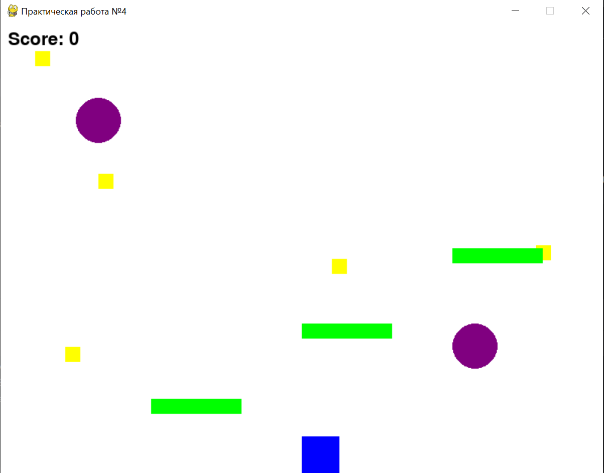

# Практическая работа №4
## Выполнила: Гиниятуллина Юлия Сергеевна, ИВТ 3 курс, 2.2

В рамках данной практической работы были реализованы следующие задания и механики:

1. Эффект портала:
* Реализованы два портала. Игрок при пересечении одного портала моментально перемещается ко второму.
* Перемещение происходит корректно: позиция игрока обновляется так, чтобы он оказался в центре второго портала.

2. Сбор предметов с фиксированными очками:
* Каждый предмет имеет собственное фиксированное значение очков, которое добавляется к общему счету при сборе.
* Уникальные очки предметов задаются случайным образом в пределах от 1 до 10, что добавляет разнообразие в игровой процесс.
* После пересечения игрока с предметом объект исчезает, а счет корректно обновляется.

3. Платформы для удобного передвижения:
* Добавлены платформы, которые помогают игроку перемещаться по игровому полю, особенно в местах, где расположены порталы.
* Платформы создают возможность использовать механику прыжков, добавляя динамику в игру.
* Они обеспечивают реалистичную обработку столкновений: игрок остается на платформе при движении сверху вниз.

4. Основная структура игрового процесса:
* Базовая физика: добавлены гравитация и прыжки, чтобы игрок мог двигаться как в стандартной платформенной игре.
* Игровой цикл обрабатывает перемещение персонажа, сбор предметов, взаимодействие с порталами и платформами.
* Система отображения очков в реальном времени позволяет игроку видеть текущий прогресс.

Результат работы: 
